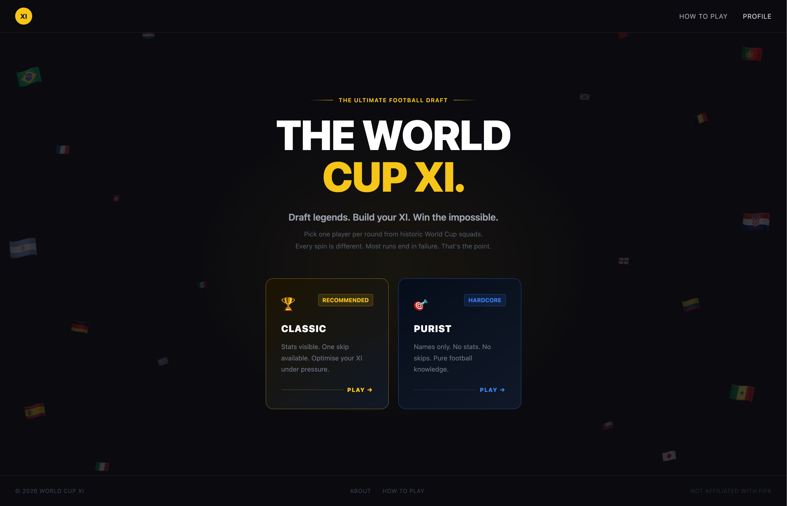

# World Cup XI

Draft a World Cup squad one player at a time, then watch them compete through a full tournament — group stage, knockouts, and (if you're lucky) the final.
[**Play now →**](https://world-cup-xi-one.vercel.app/)

---

---

## How it works

1. **Spin** — a random nation and World Cup year is drawn from the pot
2. **Pick** — choose one player from their squad for the current position
3. **Build** — draft 11 players across GK, DEF, MID, and FWD
4. **Simulate** — your XI plays a full World Cup. Group stage, then knockouts. Most runs end early.

Two modes:
- **Classic** — player stats visible, more strategic
- **Purist** — names only, pure instinct

## Stack

React 18 + Vite · Tailwind CSS · Framer Motion

---

Not affiliated with FIFA. Built for fun.
